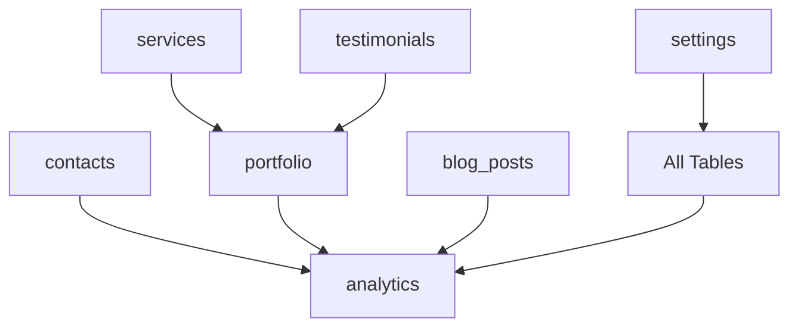

# 🗄️ Database PT Bayan Punca Digital

Dokumentasi lengkap database untuk website PT Bayan Punca Digital - Digital Marketing & Web Development Company.

## 📋 Daftar Isi

- [Overview](#overview)
- [Struktur Database](#struktur-database)
- [Instalasi](#instalasi)
- [Tabel Utama](#tabel-utama)
- [Relasi Antar Tabel](#relasi-antar-tabel)
- [Stored Procedures](#stored-procedures)
- [Views](#views)
- [Backup & Restore](#backup--restore)
- [Security](#security)

## 🎯 Overview

Database ini dirancang untuk mendukung website perusahaan PT Bayan Punca Digital dengan fitur-fitur:

- ✅ **Contact Management** - Manajemen pesan dari form kontak
- ✅ **Portfolio System** - Showcase proyek-proyek perusahaan
- ✅ **Blog/CMS** - Sistem manajemen konten dan artikel
- ✅ **Service Management** - Katalog layanan perusahaan
- ✅ **Testimonials** - Sistem testimoni klien
- ✅ **Newsletter** - Manajemen subscriber newsletter
- ✅ **Analytics** - Tracking kunjungan website
- ✅ **Settings** - Konfigurasi website

## 🏗️ Struktur Database

### Database: `u998642024_Hamzah`

| Tabel | Deskripsi | Records |
|-------|-----------|----------|
| `contacts` | Pesan dari form kontak | ~100-500/bulan |
| `portfolio` | Proyek-proyek perusahaan | ~50-100 |
| `blog_posts` | Artikel dan konten blog | ~20-50 |
| `services` | Layanan perusahaan | ~6-10 |
| `testimonials` | Testimoni klien | ~20-50 |
| `settings` | Konfigurasi website | ~15-20 |
| `newsletter_subscribers` | Subscriber newsletter | ~500-2000 |
| `analytics` | Data kunjungan website | ~1000-5000/hari |

## 🚀 Instalasi

### 1. Persiapan Database

```sql
-- Buat database baru
-- Untuk shared hosting, database sudah dibuat melalui hPanel
-- Pilih database u998642024_Hamzah di phpMyAdmin sebelum import
```

### 2. Import Schema

```bash
# Via MySQL Command Line
-- Untuk shared hosting: Import melalui phpMyAdmin
-- mysql -u u998642024_hamzah12 -p u998642024_Hamzah < database.sql

# Via phpMyAdmin
# Upload file database.sql melalui Import tab
```

### 3. Insert Data Sample

```bash
# Import data sample
-- mysql -u u998642024_hamzah12 -p u998642024_Hamzah < insert_data.sql
```

### 4. Verifikasi Instalasi

```sql
-- Cek semua tabel
SHOW TABLES;

-- Cek data sample
SELECT COUNT(*) FROM portfolio;
SELECT COUNT(*) FROM blog_posts;
```

## 📊 Tabel Utama

### 1. **contacts** - Form Kontak
```sql
CREATE TABLE contacts (
    id INT AUTO_INCREMENT PRIMARY KEY,
    name VARCHAR(100) NOT NULL,
    email VARCHAR(100) NOT NULL,
    phone VARCHAR(20),
    subject VARCHAR(200),
    message TEXT NOT NULL,
    created_at TIMESTAMP DEFAULT CURRENT_TIMESTAMP,
    status ENUM('new', 'read', 'replied', 'closed') DEFAULT 'new'
);
```

**Status Values:**
- `new` - Pesan baru belum dibaca
- `read` - Sudah dibaca
- `replied` - Sudah dibalas
- `closed` - Ditutup/selesai

### 2. **portfolio** - Proyek Perusahaan
```sql
CREATE TABLE portfolio (
    id INT AUTO_INCREMENT PRIMARY KEY,
    title VARCHAR(200) NOT NULL,
    description TEXT,
    client_name VARCHAR(100),
    project_type ENUM('website', 'mobile_app', 'digital_marketing', 'seo', 'maintenance'),
    image_url VARCHAR(500),
    project_url VARCHAR(500),
    tags JSON,
    featured BOOLEAN DEFAULT FALSE
);
```

**Project Types:**
- `website` - Pembuatan Website
- `mobile_app` - Aplikasi Mobile
- `digital_marketing` - Digital Marketing
- `seo` - SEO Optimization
- `maintenance` - Website Maintenance

### 3. **blog_posts** - Sistem Blog
```sql
CREATE TABLE blog_posts (
    id INT AUTO_INCREMENT PRIMARY KEY,
    title VARCHAR(200) NOT NULL,
    slug VARCHAR(200) UNIQUE NOT NULL,
    content LONGTEXT NOT NULL,
    category ENUM('digital_marketing', 'web_development', 'seo', 'tips', 'news'),
    status ENUM('draft', 'published', 'archived') DEFAULT 'draft',
    published_at TIMESTAMP NULL
);
```

### 4. **services** - Layanan Perusahaan
```sql
CREATE TABLE services (
    id INT AUTO_INCREMENT PRIMARY KEY,
    name VARCHAR(100) NOT NULL,
    description TEXT,
    price_start DECIMAL(10,2),
    features JSON,
    active BOOLEAN DEFAULT TRUE
);
```

## 🔗 Relasi Antar Tabel



## 🔧 Stored Procedures

### GetDashboardStats()
Mendapatkan statistik untuk dashboard admin:

```sql
CALL GetDashboardStats();
```

**Output:**
- `new_contacts_today` - Kontak baru hari ini
- `unread_contacts` - Kontak belum dibaca
- `completed_projects` - Proyek selesai
- `published_posts` - Artikel published
- `active_subscribers` - Subscriber aktif

## 👁️ Views

### active_portfolio
```sql
SELECT * FROM active_portfolio;
-- Menampilkan portfolio yang statusnya 'completed'
```

### published_posts
```sql
SELECT * FROM published_posts;
-- Menampilkan blog posts yang sudah published
```

### approved_testimonials
```sql
SELECT * FROM approved_testimonials;
-- Menampilkan testimoni yang sudah diapprove
```

## 💾 Backup & Restore

### Backup Database
```bash
# Full backup
mysqldump -u u998642024_hamzah12 -p u998642024_Hamzah > backup_$(date +%Y%m%d).sql

# Backup struktur saja
mysqldump -u u998642024_hamzah12 -p --no-data u998642024_Hamzah > structure_backup.sql

# Backup data saja
mysqldump -u u998642024_hamzah12 -p --no-create-info u998642024_Hamzah > data_backup.sql
```

### Restore Database
```bash
# Restore dari backup
mysql -u u998642024_hamzah12 -p u998642024_Hamzah < backup_20241201.sql
```

### Automated Backup (Cron Job)
```bash
# Tambahkan ke crontab untuk backup harian jam 2 pagi
0 2 * * * /usr/bin/mysqldump -u u998642024_hamzah12 -ppassword u998642024_Hamzah > /backup/db_$(date +\%Y\%m\%d).sql
```

## 🔒 Security

### 1. User Privileges
```sql
-- Buat user khusus untuk aplikasi
CREATE USER 'bayan_app'@'localhost' IDENTIFIED BY 'strong_password_here';

-- Berikan privileges yang diperlukan
GRANT SELECT, INSERT, UPDATE, DELETE ON u998642024_Hamzah.* TO 'u998642024_hamzah12'@'localhost';

-- Jangan berikan DROP, ALTER, atau privileges admin
FLUSH PRIVILEGES;
```

### 2. Backup User (Read-Only)
```sql
-- User khusus untuk backup
CREATE USER 'bayan_backup'@'localhost' IDENTIFIED BY 'backup_password';
GRANT SELECT, LOCK TABLES ON u998642024_Hamzah.* TO 'u998642024_hamzah12'@'localhost';
FLUSH PRIVILEGES;
```

### 3. Security Best Practices

- ✅ Gunakan password yang kuat (min 12 karakter)
- ✅ Aktifkan SSL untuk koneksi database
- ✅ Batasi akses IP jika memungkinkan
- ✅ Regular update MySQL/MariaDB
- ✅ Monitor log untuk aktivitas mencurigakan
- ✅ Backup regular dan test restore

## 📈 Performance Optimization

### Indexes yang Sudah Dibuat
```sql
-- Indexes untuk optimasi query
CREATE INDEX idx_contacts_created ON contacts(created_at);
CREATE INDEX idx_portfolio_featured ON portfolio(featured);
CREATE INDEX idx_blog_published ON blog_posts(published_at);
CREATE INDEX idx_analytics_date ON analytics(visit_date);
```

### Query Optimization Tips

1. **Gunakan LIMIT** untuk pagination
2. **Avoid SELECT *** - pilih kolom yang diperlukan saja
3. **Gunakan prepared statements** untuk mencegah SQL injection
4. **Cache query results** yang sering diakses

## 🔍 Monitoring

### Query untuk Monitoring

```sql
-- Cek ukuran database
SELECT 
    table_name AS 'Table',
    ROUND(((data_length + index_length) / 1024 / 1024), 2) AS 'Size (MB)'
FROM information_schema.TABLES 
WHERE table_schema = 'u998642024_Hamzah'
ORDER BY (data_length + index_length) DESC;

-- Cek aktivitas harian
SELECT 
    DATE(created_at) as date,
    COUNT(*) as new_contacts
FROM contacts 
WHERE created_at >= DATE_SUB(NOW(), INTERVAL 7 DAY)
GROUP BY DATE(created_at)
ORDER BY date DESC;
```

## 📞 Support

Jika ada pertanyaan atau masalah terkait database:

- **Email**: tech@bayanpuncadigital.com
- **WhatsApp**: +62 812 3456 7890
- **Documentation**: [Internal Wiki]

---

**PT Bayan Punca Digital** - Your Digital Success Partner 🚀

*Last Updated: December 2024*